# FixFlow AI — Application Documentation

**Document version:** 1.0 (post-buildathon implementation)  
**Baseline references:** FixFlow AI PRD v6.1, FixFlow Build Strategy v5.1  
**Repository:** `Fix-flow/fix-flow` (React + Vite + Convex)  
**Last reviewed against codebase:** May 2026

This document describes **what the app does today**, how it is built, and **how it differs** from the original PRD and build strategy. Use it for onboarding, demos, judging, and future development.

---

## Table of contents

1. [Executive summary](#1-executive-summary)
2. [Changes since PRD v6.1 / Build Strategy v5.1](#2-changes-since-prd-v61--build-strategy-v51)
3. [Product overview](#3-product-overview)
4. [User roles and permissions](#4-user-roles-and-permissions)
5. [End-to-end workflows](#5-end-to-end-workflows)
6. [Architecture](#6-architecture)
7. [Technology stack](#7-technology-stack)
8. [Data model](#8-data-model)
9. [Backend (Convex) reference](#9-backend-convex-reference)
10. [Frontend reference](#10-frontend-reference)
11. [Convex components](#11-convex-components)
12. [AI classification and translation](#12-ai-classification-and-translation)
13. [Geospatial supplier discovery](#13-geospatial-supplier-discovery)
14. [Messaging and notifications](#14-messaging-and-notifications)
15. [Rate limiting](#15-rate-limiting)
16. [Authentication and demo accounts](#16-authentication-and-demo-accounts)
17. [Environment variables](#17-environment-variables)
18. [Development and deployment](#18-development-and-deployment)
19. [Testing and demo scripts](#19-testing-and-demo-scripts)
20. [Known limitations and future work](#20-known-limitations-and-future-work)

---

## 1. Executive summary

FixFlow AI is a **property maintenance marketplace** for homeowners and tradespeople. An owner describes a repair; **Claude** classifies it and produces an English summary. The owner invites up to **three nearby suppliers** (geospatial filter from the job pin), receives **live quotes** via Convex reactive queries, chats with masked identities, **accepts a final quote**, then follows a **work-complete → pay** lifecycle before the job is closed.

**Convex is the core story:** mutations write data; `useQuery` subscriptions push updates to every open client with **no polling**—quotes, notifications, and supplier lists update in real time.

---

## 2. Changes since PRD v6.1 / Build Strategy v5.1

The PRD and build strategy describe the **first-version plan** (buildathon scope). The shipped app adds UX, workflow, and infrastructure beyond that plan.

| Area | PRD v6.1 / Build Strategy v5.1 | Current implementation |
|------|-------------------------------|-------------------------|
| **Admin role** | Admin approves/suspends suppliers; admin dashboard (Exp R5) | **Removed from UI.** No `/admin/dashboard`. Admin APIs removed from `suppliers.ts`. Existing `admin` users see “Admin not available” and sign out. Suppliers **auto-approved** on signup. |
| **Payments** | Dodo Payments removed from build; verbal only | **Demo payment flow:** supplier marks job complete → owner **Confirm payment** (records `paidAt`; no card gateway). |
| **Job status** | `open` → quote → accept → (implied done) | **`in_progress`** → **`awaiting_payment`** → **`completed`**, plus `workCompletedAt` / `paidAt`. |
| **Quote acceptance** | Accept quote | Owner can accept only when supplier marks quote **`isFinal`**. |
| **Geography in UI** | Kadana / Gampaha called out in copy | UI says **“near you”** / **15 km**; backend still uses **Kadana centre** coordinates for search. |
| **Owner home UI** | Single-page form | **Dashboard layout:** new request card + **past requests sidebar**, step hint, photo upload zone. |
| **Supplier UI** | List of quote cards | **Dashboard:** filters (All / Needs quote / Submitted / Active jobs / Closed), stats sidebar, **notification feed** with tap-to-open chat. |
| **Messaging** | Masked chat (Exp R4) | Chat + **per-thread unread badges**, **notification list**, mark read on open; `new_message` notifications. |
| **Supplier UI language** | Multilingual supplier notifications | Dashboard chrome **English**; job summaries use **EN / SI / TA tabs** on each card. |
| **Rate limiting** | Not in original PRD | **`@convex-dev/rate-limiter`** on jobs, quotes, chat, LLM, payments. |
| **Categories** | Includes Structural / Masonry | **Roofing** category; legacy “Structural / Masonry” mapped to Roofing in discovery. |
| **Account menu** | — | Fixed **account menu** (initials, sign out) on all authenticated routes. |
| **Past requests** | — | Owner **workflow badges** (classifying, find suppliers, pending quotes, select supplier, work in progress, pay supplier, completed). |

---

## 3. Product overview

### Problem

Property maintenance in Sri Lanka often relies on informal networks (calls, WhatsApp). FixFlow structures discovery, quoting, chat, and job closure in one reactive web app.

### Value proposition

- **Owners:** One place to report issues, compare quotes, message tradespeople, and pay after work is done.
- **Suppliers:** Incoming quote requests, quote submission, chat with homeowners, and clear job/payment status.
- **Judges / technical audience:** Convex `useQuery` drives live quote inbox, notifications, and geospatial filtering without refresh.

### Geographic scope (backend)

- Search origin: **Kadana centre** — lat `7.0167`, lng `79.9833` (`convex/supplierGeospatial.ts`).
- Bounding box: ~**15 km** radius (`BBOX_RADIUS_DEG = 0.14`, `MAX_DISTANCE_KM = 15`).
- Seeded suppliers outside the box **do not appear** in discovery (by design for demo).

---

## 4. User roles and permissions

| Role | Sign up? | Dashboard | Notes |
|------|----------|-----------|--------|
| **owner** | Yes | `/owner/dashboard` | Submit jobs, discover suppliers, quotes, chat, accept final quotes, pay. |
| **supplier** | Yes | `/supplier/dashboard` | View invitations, submit/update quotes, mark work complete, chat. |
| **admin** | No longer supported in UI | — | Schema still allows `role: "admin"` for legacy rows; no admin tools. |

Authorization is enforced in Convex (e.g. `getAuthUserId`, job `ownerId`, quote request membership for chat).

---

## 5. End-to-end workflows

### 5.1 Owner journey (happy path)

```mermaid
flowchart LR
  A[Sign up / Log in] --> B[New repair request]
  B --> C[AI classifying]
  C --> D[Review summary + category]
  D --> E[Find nearby suppliers]
  E --> F[Quote inbox]
  F --> G[Supplier marks final quote]
  G --> H[Accept quote]
  H --> I[Work in progress]
  I --> J[Supplier marks complete]
  J --> K[Owner confirms payment]
  K --> L[Completed]
```



| Step | UI | Job `status` | Owner workflow badge |
|------|-----|--------------|----------------------|
| Submit description (+ optional photo) | Home dashboard | `classifying` | Classifying |
| AI finishes | Classification view | `open` | Find suppliers |
| Invite ≤3 suppliers | Supplier discovery | `open` | Pending quotes |
| Quotes arrive | Quote inbox | `open` | Select supplier |
| Accept **final** quote | Quote inbox | `in_progress` | Work in progress |
| Supplier marks done | Job detail banner | `awaiting_payment` | Pay supplier |
| Confirm payment | Payment panel | `completed` | Completed |

### 5.2 Supplier journey (happy path)

1. Log in → **Incoming requests** (filter as needed).
2. Receive **quote request** notification when owner invites them.
3. Submit quote (price LKR, days, notes, optional **final quote** checkbox).
4. If accepted: **Job in progress** → **Mark job complete**.
5. Wait for owner payment → **Payment received** notification when owner confirms.

### 5.3 Quote rules

- Owner may invite **at most 3** suppliers per job.
- Supplier must be **approved**, **available**, not **suspended**, in range, and matching trade **category**.
- Owner **accept** requires: quote `status === "quoted"`, `isFinal === true`, job `status === "open"`.
- On accept: other pending/quoted requests → `rejected`; job → `in_progress`, `acceptedSupplierId` set.

### 5.4 Payment rules (demo)

- Not integrated with Dodo or card processors.
- `ownerConfirmPayment` sets `status: "completed"` and `paidAt`.
- UI states this is **demo only**.

---

## 6. Architecture

```
┌─────────────────────────────────────────────────────────────┐
│  Browser (React 18 + Vite + React Router)                   │
│  • useQuery / useMutation → Convex client                   │
│  • Owner + Supplier dashboards, auth pages                  │
└───────────────────────────┬─────────────────────────────────┘
                            │
┌───────────────────────────▼─────────────────────────────────┐
│  Convex Cloud                                               │
│  • Queries / Mutations / Actions                            │
│  • File storage (job photos)                                │
│  • Scheduled functions (classifyIssue)                      │
│  • Components: @convex-dev/auth, geospatial, rate-limiter   │
└───────────────────────────┬─────────────────────────────────┘
                            │
         ┌──────────────────┼──────────────────┐
         ▼                  ▼                  ▼
   OpenAI API          OpenRouter         (optional)
   GPT-4o-mini         fallback           Dodo SDK in
   classify/translate  same API shape     package.json —
                                         not wired in UI
```

**Reactive pattern (demo headline):**  
`submitQuote` mutation → `quoteRequests` table updates → owner's `getLiveQuotes` query re-runs → UI re-renders. Same for notifications and unread counts.

---

## 7. Technology stack

| Layer | Choice |
|-------|--------|
| Frontend | React 18, TypeScript, Vite, React Router 7 |
| Styling | Tailwind CSS, shared tokens in `src/lib/fixflowUi.ts` |
| Backend | Convex (queries, mutations, actions, cron/scheduler) |
| Auth | `@convex-dev/auth` + Password provider |
| Geospatial | `@convex-dev/geospatial` |
| Rate limits | `@convex-dev/rate-limiter` |
| AI | Claude Haiku (Anthropic, primary), OpenRouter Claude fallback (`convex/llm.ts`) |
| UI primitives | Radix (shadcn-style components in `src/components/ui/`) |

---

## 8. Data model

Defined in `convex/schema.ts` (plus Convex Auth tables).

### `users`

| Field | Purpose |
|-------|---------|
| `role` | `owner` \| `supplier` \| `admin` |
| `preferredLanguage` | `en` \| `si` \| `ta` (supplier notifications / profile) |
| `category`, `rating`, `lat`, `lng` | Supplier trade and map position |
| `approved`, `suspended`, `available` | Discovery filters |

### `jobs`

| Field | Purpose |
|-------|---------|
| `status` | `classifying` → `open` → `in_progress` → `awaiting_payment` → `completed` |
| `description`, `photoId` | Owner input |
| `category`, `subcategory`, `urgency` | AI + owner edits |
| `aiSummary`, `aiSummary_si`, `aiSummary_ta` | Summaries |
| `acceptedSupplierId` | Set on quote accept |
| `workCompletedAt`, `paidAt` | Completion lifecycle |
| `classificationFailed` | Fallback when LLM fails |

### `quoteRequests`

| Field | Purpose |
|-------|---------|
| `jobId`, `supplierId` | Link |
| `status` | `pending` \| `quoted` \| `accepted` \| `rejected` |
| `priceLKR`, `duration`, `notes`, `isFinal` | Quote payload |

### `messages`

Per-job thread between two user IDs; `read` flag for unread counts.

### `notifications`

`userId`, `type`, `message`, `read`, optional `jobId` — powers bell badge and sidebar feed.

### `reviews`

Schema present; **review UI not implemented** in current frontend.

---

## 9. Backend (Convex) reference

### Jobs — `convex/jobs.ts`

| Export | Type | Description |
|--------|------|-------------|
| `generateUploadUrl` | mutation | Owner photo upload |
| `submitJob` | mutation | Create job, schedule `classifyIssue` |
| `getJob` | query | Owner job detail + `acceptedQuote` summary |
| `listMyJobs` | query | Past jobs with `workflowStatus` |
| `updateSummary` | mutation | Owner edits English summary |
| `updateJobClassification` | mutation | Owner edits category/urgency |
| `supplierMarkWorkComplete` | mutation | `in_progress` → `awaiting_payment` |
| `ownerConfirmPayment` | mutation | `awaiting_payment` → `completed` |
| `classifyIssue` | internalAction | LLM classify + translate |

### Suppliers — `convex/suppliers.ts`

| Export | Type | Description |
|--------|------|-------------|
| `getSuppliersNearKadana` | query | Geospatial discovery for owners |
| `selectSuppliers` | mutation | Create quote requests, notify suppliers |
| `indexAllSuppliers` | mutation | Backfill geospatial index + category migration |
| `notifySuppliers` | internalAction | Multilingual notification delivery |

### Quote requests — `convex/quoteRequests.ts`

| Export | Type | Description |
|--------|------|-------------|
| `getLiveQuotes` | query | Owner quote inbox (sorted by price) |
| `submitQuote` | mutation | Supplier submit/update quote |
| `acceptQuote` | mutation | Owner accepts final quote |
| `listForSupplier` | query | Supplier dashboard feed |

### Messages — `convex/messages.ts`

| Export | Type | Description |
|--------|------|-------------|
| `list` / `getMessages` | query | Job messages (participant check) |
| `send` | mutation | Send + notify receiver |
| `unreadCountForThread` | query | Badge counts |
| `markThreadRead` | mutation | Clear unread on chat open |

### Notifications — `convex/notifications.ts`

| Export | Type | Description |
|--------|------|-------------|
| `getUnreadCount` | query | Bell badge |
| `listRecent` | query | Sidebar feed |
| `markReadForJob` | mutation | Clear job notifications when opening chat |

### Other

| Module | Exports |
|--------|---------|
| `users.ts` | `getUser` |
| `demoAuth.ts` | `setupDemoSupplierPasswords`, `getDemoSupplierLoginInfo` |
| `seed.ts` | `seedSuppliers` |
| `rateLimits.ts` | `enforceRateLimit`, limit definitions |
| `auth.ts` | Convex Auth setup |

---

## 10. Frontend reference

### Routes — `src/App.tsx`

| Path | Screen |
|------|--------|
| `/login`, `/signup` | Auth |
| `/` | Role picker → redirects by role |
| `/owner/dashboard` | Owner home / job flow |
| `/supplier/dashboard` | Supplier dashboard |

`AuthenticatedShell` wraps dashboards with fixed **account menu** (top right).

### Owner components

| Component | Role |
|-----------|------|
| `OwnerHomeDashboard` | New request form + past jobs sidebar |
| `OwnerPastJobs` | List with workflow badges; opens job |
| `OwnerStepHint` | Steps 1–3 indicator |
| `ClassificationResult` | In `Dashboard.tsx` — summary, discovery, quotes entry |
| `SupplierDiscovery` | Pick up to 3 suppliers |
| `LiveQuotesDashboard` | Quote inbox, accept, chat |
| `OwnerJobPaymentPanel` | Work in progress / ready to pay / paid banners |
| `ChatPanel` | Masked 1:1 chat |

### Supplier components

| Component | Role |
|-----------|------|
| `SupplierHomeDashboard` | Layout, filters, stats, notifications |
| `IncomingQuoteCard` | Quote form, completion, chat |
| `NotificationFeed` | Tap message → open job chat |

### Shared

| Module | Role |
|--------|------|
| `fixflowUi.ts` | Buttons, cards, page layout classes |
| `userFacingError.ts` | Friendly API errors (incl. rate limits) |
| `jobCategories.ts` / `supplierDashboardUi.ts` | Categories and supplier copy |

---

## 11. Convex components

Configured in `convex/convex.config.ts`:

```ts
app.use(geospatial);
app.use(rateLimiter);
```

### Geospatial (`@convex-dev/geospatial`)

- Index: `supplierGeospatial` in `convex/supplierGeospatial.ts`.
- Filters: category, `approved`, `available`, `suspended`.
- Distance: Haversine from Kadana; displayed on `SupplierCard`.

### Rate limiter (`@convex-dev/rate-limiter`)

See [§15 Rate limiting](#15-rate-limiting).

### Auth (`@convex-dev/auth`)

- Password sign-up with `role` (`owner` | `supplier` only from UI).
- `createOrUpdateUser` links password accounts to existing seeded supplier emails.

---

## 12. AI classification and translation

**Flow:** `submitJob` → scheduler → `classifyIssue` (action).

1. **Classify** (optional image): category, subcategory, urgency, English summary — JSON from GPT-4o-mini.
2. **Translate:** Sinhala + Tamil summaries.
3. **Success:** `applyClassification` → `status: "open"`.
4. **Failure:** `markClassificationFailed` → defaults + `classificationFailed: true`.

**Providers:** `convex/llm.ts` — Anthropic Claude first, OpenRouter Claude fallback.

**Rate limit:** `llmClassify` (2 units per job for classify + translate).

**Owner edits:** Category/urgency and English summary editable while `open`.

---

## 13. Geospatial supplier discovery

1. Owner opens discovery with job `category`.
2. `getSuppliersNearKadana` queries geospatial rectangle around Kadana.
3. Results sorted by **distance ascending**; card shows km and rating.
4. Owner selects 1–3 → `selectSuppliers` creates `quoteRequests` and notifies suppliers (SI/TA/EN message based on `preferredLanguage`).

**Maintenance:** Run `suppliers:indexAllSuppliers` after seed or coordinate changes.

---

## 14. Messaging and notifications

### Chat

- **Masked labels:** “Homeowner” / “Tradesperson” — no names in `ChatPanel`.
- **Authorization:** Owner or supplier with a `quoteRequest` on that job.
- **Unread:** Red badge on “Message homeowner” / “Message this tradesperson”; opening chat calls `markThreadRead` + `markReadForJob`.

### Notification types (examples)

| `type` | When |
|--------|------|
| `quote_request` | Owner invites supplier |
| `new_quote` | Supplier submits quote |
| `new_message` | Chat message |
| `quote_accepted` | Owner accepts quote |
| `quote_not_selected` | Another supplier won |
| `job_ready_for_payment` | Supplier marked complete |
| `payment_received` | Owner confirmed payment |

Supplier sidebar: **NotificationFeed** — tap `new_message` to open that job’s chat.

---

## 15. Rate limiting

**File:** `convex/rateLimits.ts`  
**Helper:** `enforceRateLimit(ctx, name, { key: userId })`

| Limit | Default policy | Applied in |
|-------|----------------|------------|
| `submitJob` | 5/min, burst 2 | `jobs.submitJob` |
| `sendMessage` | 30/min, burst 10 | `messages.send` |
| `submitQuote` | 15/min, burst 5 | `quoteRequests.submitQuote` |
| `acceptQuote` | 10/min | `quoteRequests.acceptQuote` |
| `selectSuppliers` | 15/min | `suppliers.selectSuppliers` |
| `markWorkComplete` | 10/hour | `jobs.supplierMarkWorkComplete` |
| `confirmPayment` | 10/min | `jobs.ownerConfirmPayment` |
| `llmClassify` | 40/min, 5 shards | `jobs.classifyIssue` |

Errors surface in UI as “Too many requests. Please wait…”

---

## 16. Authentication and demo accounts

### Sign up

- **Owner** or **supplier** only (signup form).
- Suppliers get `approved: true` immediately (no admin queue).

### Demo suppliers

1. Run seed: `npx convex run seed:seedSuppliers`
2. Run: `npx convex run demoAuth:setupDemoSupplierPasswords`
3. Log in with any `@fixflow.lk` supplier email, password **`FixFlowDemo1`**

Example: `mahesh.rathnayake.8@fixflow.lk`

### Demo info query

`demoAuth:getDemoSupplierLoginInfo` — password hint for tooling.

---

## 17. Environment variables

### Local — `.env.local` (Vite)

| Variable | Purpose |
|----------|---------|
| `VITE_CONVEX_URL` | Convex deployment URL |

### Convex dashboard (environment variables)

| Variable | Purpose |
|----------|---------|
| `ANTHROPIC_API_KEY` | Primary LLM (Claude) |
| `OPENROUTER_API_KEY` | Optional Claude fallback via OpenRouter |
| Auth secrets | Per `@convex-dev/auth` setup |

---

## 18. Development and deployment

```bash
cd Fix-flow/fix-flow
npm install
npm run dev          # convex dev + Vite
npm run build        # tsc + vite build
npm run lint         # tsc + eslint
```

**Project layout:**

```
fix-flow/
├── convex/           # Backend
├── src/
│   ├── pages/        # Login, owner, supplier
│   ├── components/   # UI by feature
│   └── lib/          # Shared UI + errors
├── DOCUMENTATION.md  # This file
└── package.json
```

**PRD note:** Netlify deployment was deferred in v6.1; production URL depends on your deployment choice.

---

## 19. Testing and demo scripts

### Two-window live quote test (Build Strategy F6)

1. Window A: owner — open quote inbox for a job.  
2. Window B: supplier — submit quote on same job.  
3. **Expect:** quote appears in A within ~2s **without refresh**.

### Work-complete → pay test

1. Owner accepts **final** quote.  
2. Supplier: **Active jobs** tab → **Mark job complete**.  
3. Owner: job page shows **Ready to pay** → **Confirm payment**.  
4. Supplier: notification **Payment received**.

### Convex CLI (common)

```bash
npx convex run seed:seedSuppliers
npx convex run demoAuth:setupDemoSupplierPasswords
npx convex run suppliers:indexAllSuppliers
```

---

## 20. Known limitations and future work

| Item | Status |
|------|--------|
| Admin approve/suspend UI | Removed; re-enable would need new UI + restore APIs |
| Dodo Payments | Package present; **not integrated** |
| Reviews table | Schema only; no UI |
| Real payment gateway | Demo confirm only |
| `src/Chat/` legacy components | Not used by main app routes (superseded by `ChatPanel`) |
| Rate limit client hooks | Server-side only; optional `useRateLimit` not added |
| Multilingual owner UI | English-first; summaries in three languages |
| Exact owner address | Not collected; discovery uses fixed Kadana origin |

---

## Appendix A — Trade categories

From `convex/jobCategories.ts`:

- Plumbing  
- Electrical  
- Roofing  
- Carpentry  
- Painting  
- Garden / Landscaping  
- General Maintenance  

Legacy **Structural / Masonry** maps to **Roofing** for discovery and display.

---

## Appendix B — Owner workflow status mapping

Computed in `ownerWorkflowStatus()` (`convex/jobs.ts`):

| `workflowStatus` | Meaning |
|------------------|---------|
| `classifying` | AI running |
| `find_suppliers` | Open job, no invites yet |
| `pending_quotes` | Invites sent, waiting for quotes |
| `select_supplier` | At least one quote received |
| `work_in_progress` | Quote accepted, work ongoing |
| `pay_supplier` | Awaiting owner payment |
| `completed` | Paid and closed |

---

## Appendix C — Document history

| Version | Date | Notes |
|---------|------|-------|
| 1.0 | May 2026 | Full app documentation vs PRD v6.1 / Build Strategy v5.1 |

For original product intent and buildathon hour-by-hour plan, refer to **FixFlow_AI_PRD_v6.1.docx** and **FixFlow_BuildStrategy_v5.1.docx**.
